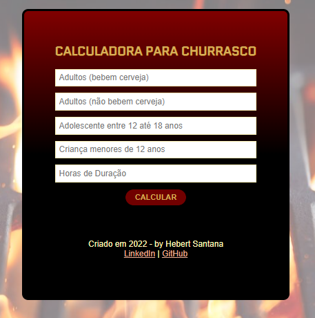

# Churrascometro (Programador BR)
## Projeto (finalizado :white_check_mark:)

Projeto desenvolvido durante curso de <strong><em>"Curso de Desenvolvimento WEB FULL STACK"</em></strong> do curso <strong>Programador BR</strong>.

## 🛠️ Recursos

* HTML
* CSS
* Javascript

## 💻 Demonstração
 

 
 

## 🌐 Site

<https://hebert-santana.github.io/churrascometro/>

## Autor
~~~ javascript
Hebert Santana
~~~

